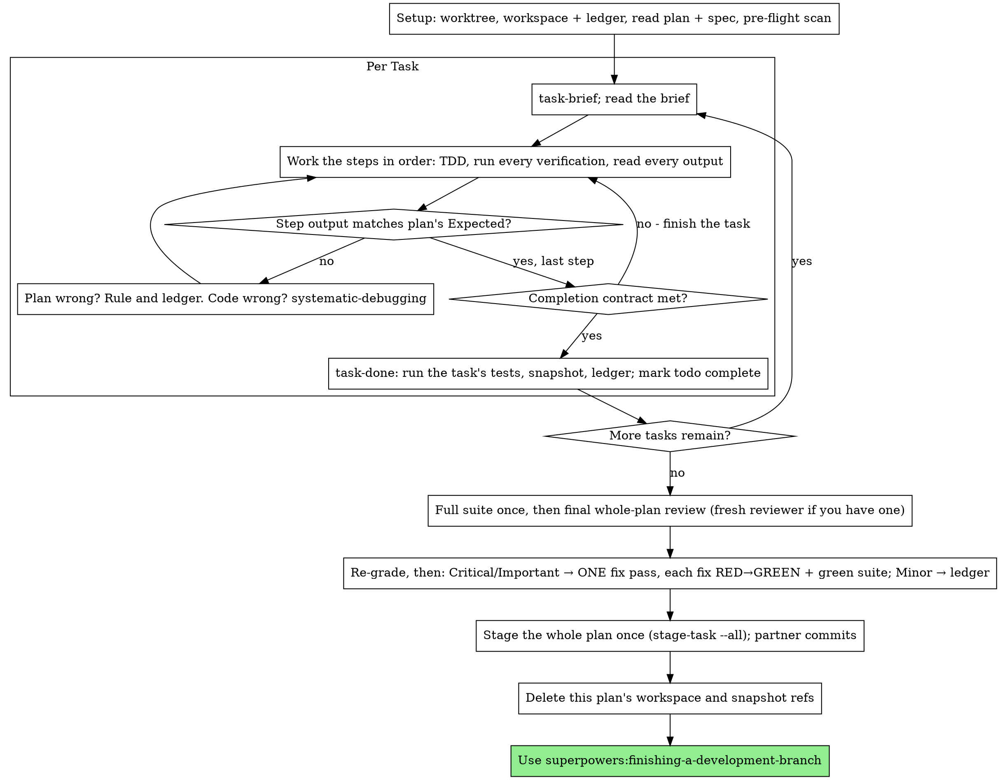

# Upstream 6.4.1 Adoption Implementation Plan

> **For agentic workers:** REQUIRED SUB-SKILL: Use superpowers:subagent-driven-development (recommended) or superpowers:executing-plans to implement this plan task-by-task. Steps use checkbox (`- [ ]`) syntax for tracking.

**Goal:** Bring the parts of obra/superpowers v6.4.1 that fit this fork into it, adapted to the fork's human commit gate.

**Architecture:** Five independent changes. The fork's scripts and skills stay the base; upstream text is taken from the local `v6.4.1` tag and edited where it assumes agents commit. Native execution (task 4) reuses the SDD scripts the fork already has (`park-task`, `review-package --plan`, `stage-task --all`) instead of upstream's commit-per-task helpers.

**Tech Stack:** Bash scripts, Markdown skills, bash test scripts under `tests/`.

**Spec:** none written. The design was agreed in conversation on 2026-09-25; its decisions are recorded under Global Constraints. Rulings made during execution are provisional on that basis.

**Not in this plan:** the Review Focus section and plan-review-before-execution handoff (upstream 6.4.2 rewrites `writing-plans` again — port once, after it ships); upstream's empty-range guard in `review-package`; `bash scripts/...` invocation for exec-bit-stripping packagers; the Claude Code nested-orchestrator note; Muse, OpenCode 2.0 and Qwen support; README updates.

**Shared files (these tasks serialize):** `skills/subagent-driven-development/SKILL.md` is edited by tasks 2, 3, 4 and 5; `tests/claude-code/run-skill-tests.sh` by tasks 3, 4 and 5. Each edit touches a different section, so the order does not matter; they share the file only because the rules live there.

## Global Constraints

- Agents never run `git commit` and never stage. The plan and any spec are never committed.
- Commit messages are a short plain subject in sentence case, no `type(scope):` prefix.
- No new code comments unless they state something the code cannot; skill prose says "your human partner", never "the user".
- Upstream text comes from the local tag `v6.4.1` via `git show v6.4.1:<path>` or `git archive v6.4.1 <path> | tar -x`. Never `git checkout v6.4.1 -- <path>`: it writes the index.
- The full project suite runs once, right before the final whole-branch review — by the controller under subagent-driven development, by the session under Native execution. Per-task test runs cover only the task's own tests.
- Native execution commits nothing and stages nothing until the end: one `stage-task PLAN_FILE --all` after the final review, then the human partner commits once.
- The fork's GitHub repository has issues disabled; nothing in the fork offers to file a GitHub issue.
- This repo's full suite: `bash tests/claude-code/run-skill-tests.sh` (includes `test-subagent-driven-development.sh`, which drives the `claude` CLI for several minutes) plus `bash tests/diagnosing-superpowers/test-skill-structure.sh`.

---

### Task 1: Import diagnosing-superpowers without the issue step

**Depends on:** none

**Exclusive:** none

**Files:**
- Create: `skills/diagnosing-superpowers/SKILL.md`
- Create: `skills/diagnosing-superpowers/prompts/analyst-common.md`
- Create: `skills/diagnosing-superpowers/prompts/cost-and-time.md`
- Create: `skills/diagnosing-superpowers/prompts/plan-adherence.md`
- Create: `skills/diagnosing-superpowers/prompts/quality-evidence.md`
- Create: `skills/diagnosing-superpowers/prompts/repeated-work.md`
- Create: `skills/diagnosing-superpowers/prompts/request-conflicts.md`
- Create: `skills/diagnosing-superpowers/prompts/scrub-audit.md`
- Create: `skills/diagnosing-superpowers/prompts/scrub.md`
- Create: `skills/diagnosing-superpowers/prompts/similar-session.md`
- Create: `skills/diagnosing-superpowers/prompts/skill-timeline.md`
- Create: `skills/diagnosing-superpowers/prompts/stumbles.md`
- Create: `skills/diagnosing-superpowers/references/context-safety.md`
- Create: `skills/diagnosing-superpowers/references/redaction-policy.md`
- Create: `skills/diagnosing-superpowers/references/session-discovery.md`
- Create: `skills/diagnosing-superpowers/templates/bundle-README.md`
- Create: `skills/diagnosing-superpowers/templates/case.md`
- Create: `skills/diagnosing-superpowers/templates/report.md`
- Test: `tests/diagnosing-superpowers/test-skill-structure.sh`

**Interfaces:**
- Consumes: nothing
- Produces:
  - `diagnosing-superpowers` — skill that reports what went wrong in a session, with `path:line` evidence, and optionally builds a scrubbed bundle

- [ ] **Step 1: Import the upstream files, minus the issue-filing ones**

Run from the repo root:

```bash
git archive v6.4.1 skills/diagnosing-superpowers tests/diagnosing-superpowers | tar -x
rm skills/diagnosing-superpowers/references/github-issues.md skills/diagnosing-superpowers/templates/issue.md
```

- [ ] **Step 2: Make the structure test expect the issue step gone**

In `tests/diagnosing-superpowers/test-skill-structure.sh`:

Remove `  references/github-issues.md` and `  templates/issue.md` from the `expected_files=(` array.

Add both to the `removed_files=(` array, so it reads:

```bash
removed_files=(
  references/claude-code-sessions.md
  references/codex-sessions.md
  references/other-harnesses.md
  references/github-issues.md
  templates/issue.md
)
```

Replace the regex in the `removed_reference_hits` line:

```bash
removed_reference_hits="$(grep -rn -E '(references/(claude-code-sessions|codex-sessions|other-harnesses|github-issues)|templates/issue)\.md' "$SKILL_DIR" --include='*.md' 2>/dev/null || true)"
```

Insert this block directly above the `# --- no local paths or names in shipped files` comment:

```bash
# --- this fork files no issues: the report and bundle are the output ------
issue_hits="$(grep -rn -E 'GitHub issue|issue step|No issue or comment|or the issue|obra/superpowers' "$SKILL_DIR" --include='*.md' 2>/dev/null || true)"
if [ -z "$issue_hits" ]; then
  pass "skill prose never offers to file an issue"
else
  fail "skill prose never offers to file an issue"
  printf '%s\n' "$issue_hits" | head -10 | sed 's/^/    /'
fi

```

- [ ] **Step 3: Run the test to verify it fails**

Run: `bash tests/diagnosing-superpowers/test-skill-structure.sh`
Expected: FAIL, `Passed: 43  Failed: 4` — `referenced file exists` for both removed files, the removed-reference check, and `skill prose never offers to file an issue`.

- [ ] **Step 4: Remove the issue step from the skill**

In `skills/diagnosing-superpowers/SKILL.md`:

- In the `description:` line, delete ` — or wants to build a bug report for the superpowers maintainers` so it continues directly with `, for the current session or a past one identified by id or path, on any harness.`
- Replace `Whoever triages the bundle or the issue` with `Whoever triages the report or the bundle` (the line wrap after it stays).
- Replace `Steps 5–7 run only on their stated condition.` with `Steps 5–6 run only on their stated condition.`
- Delete the whole step `5. **GitHub issues** — ...` (seven lines, ending `your partner its path to attach in the browser.`).
- Renumber `6. **Export**` to `5. **Export**` and `7. **Similar sessions**` to `6. **Similar sessions**`.
- In the **No superpowers diagnosis** hard rule, replace `point at the issue step and` + newline + `  mention that a bundle is available on request.` with `mention that a bundle is` + newline + `  available on request.`
- In the **Approval gates** hard rule, delete the sentence `No issue or comment before they approve the exact text.` so the rule ends at `log and file list.`
- Replace `Nothing in steps 2–7 starts` with `Nothing in steps 2–6 starts`.

In `skills/diagnosing-superpowers/templates/bundle-README.md`, replace:

```text
Reconcile report, case, environment, findings, README and any local issue
draft.
```

with:

```text
Reconcile report, case, environment, findings and README.
```

- [ ] **Step 5: Run the test to verify it passes**

Run: `bash tests/diagnosing-superpowers/test-skill-structure.sh`
Expected: PASS, `Passed: 45  Failed: 0`

- [ ] **Step 6: Report**

```text
Files touched: skills/diagnosing-superpowers/ (18 files), tests/diagnosing-superpowers/test-skill-structure.sh
Proposed commit message:
  Add diagnosing-superpowers without the issue-filing step
```

---

### Task 2: Key snapshot refs by plan workspace

**Depends on:** none

**Exclusive:** none

**Files:**
- Modify: `skills/subagent-driven-development/scripts/sdd-workspace`
- Modify: `skills/subagent-driven-development/scripts/park-task:23-25`
- Modify: `skills/subagent-driven-development/scripts/restore-task:22-24`
- Modify: `skills/subagent-driven-development/scripts/review-package:35-36`
- Modify: `skills/subagent-driven-development/SKILL.md`
- Test: `tests/claude-code/test-park-restore.sh`
- Test: `tests/claude-code/test-sdd-workspace.sh`

**Interfaces:**
- Consumes: nothing
- Produces:
  - `sdd-workspace` — unchanged usage; now records a `plan-path` marker and disambiguates same-basename plans (`<slug>-<parent-dir>`, then a counter)
  - `refs/superpowers/sdd/<workspace-name>/task-N` — snapshot ref namespace, where `<workspace-name>` is `basename` of the path `sdd-workspace` prints

- [ ] **Step 1: Write the failing tests**

In `tests/claude-code/test-park-restore.sh`, insert directly above the final `    echo ""` (the one followed by `if [[ "$FAILURES" -eq 0 ]]; then echo "All park/restore tests passed"`):

```bash
    # Two plans sharing a basename must not share a snapshot namespace, or one
    # plan's park overwrites the other's and restore brings back the wrong work.
    mkdir -p docs/alpha docs/beta
    for d in alpha beta; do
        cat > "docs/$d/plan.md" <<FIXPLAN
### Task 1: Thing

**Depends on:** none
**Files:**
- Modify: \`src/$d.txt\`
**Exclusive:** none
**Interfaces:**
- Consumes: nothing
- Produces:
  - \`thing\`
FIXPLAN
        echo "$d original" > "src/$d.txt"
    done
    git add docs src/alpha.txt src/beta.txt && git commit -q -m "two plans"

    echo "alpha work" > src/alpha.txt
    echo "beta work" > src/beta.txt
    local ref_alpha ref_beta
    ref_alpha="$("$SDD_SCRIPTS/park-task" docs/alpha/plan.md 1 | cut -d' ' -f1)"
    ref_beta="$("$SDD_SCRIPTS/park-task" docs/beta/plan.md 1 | cut -d' ' -f1)"
    [[ "$ref_alpha" != "$ref_beta" ]] \
        && pass "same-basename plans park to distinct refs" \
        || fail "same-basename plans park to distinct refs ($ref_alpha)"

    echo "clobbered" > src/alpha.txt
    "$SDD_SCRIPTS/restore-task" docs/alpha/plan.md 1 > /dev/null
    [[ "$(cat src/alpha.txt)" == "alpha work" ]] \
        && pass "restore reads the plan's own snapshot" \
        || fail "restore reads the plan's own snapshot (got: $(cat src/alpha.txt))"

```

In `tests/claude-code/test-sdd-workspace.sh`, insert upstream's ownership-marker tests directly above the final `    echo ""` (the one followed by `if [[ "$FAILURES" -ne 0 ]]; then`). The block is lines 231–351 of the upstream file:

```bash
git show v6.4.1:tests/claude-code/test-sdd-workspace.sh | sed -n 231,351p
```

It starts with `    # --- Ownership markers: two plans with the same basename (#2045) ---` and ends with the `fi` closing the `out-of-repo plan gets a basename slug and an absolute-path marker` check. Take only this block: the rest of upstream's version tests the range guard and exec-bit handling, which this plan does not port.

- [ ] **Step 2: Run the tests to verify they fail**

Run: `bash tests/claude-code/test-park-restore.sh`
Expected: FAIL, `2 failure(s)`: `same-basename plans park to distinct refs (refs/superpowers/sdd/plan/task-1)` and `restore reads the plan's own snapshot (got: alpha original)`

Run: `bash tests/claude-code/test-sdd-workspace.sh`
Expected: FAIL, starting with `same-basename plans resolve to distinct workspaces`

- [ ] **Step 3: Take upstream's sdd-workspace**

```bash
git show v6.4.1:skills/subagent-driven-development/scripts/sdd-workspace > skills/subagent-driven-development/scripts/sdd-workspace
```

The fork never changed this file, so this is exactly upstream's collision fix. The redirect keeps the file's executable bit.

- [ ] **Step 4: Derive the ref slug from the workspace**

In `skills/subagent-driven-development/scripts/park-task`, replace:

```bash
slug=$(basename "$plan" .md)
```

with:

```bash
slug=$(basename "$ws")
```

In `skills/subagent-driven-development/scripts/review-package` (inside the `--task` branch, right after `ws=$("$here/sdd-workspace" "$plan")`), replace:

```bash
  slug=$(basename "$plan" .md)
```

with:

```bash
  slug=$(basename "$ws")
```

In `skills/subagent-driven-development/scripts/restore-task`, replace:

```bash
slug=$(basename "$plan" .md)
```

with:

```bash
slug=$(basename "$("$here/sdd-workspace" "$plan")")
```

- [ ] **Step 5: Update the SKILL.md references to the namespace**

In `skills/subagent-driven-development/SKILL.md`, replace:

```text
  directory (`<repo-root>/.superpowers/sdd/<plan-basename>/`), home to
  every artifact for THIS plan
```

with:

```text
  directory (`<repo-root>/.superpowers/sdd/<workspace-name>/`, where
  `<workspace-name>` is the plan's basename unless another plan already owns
  that name), home to every artifact for THIS plan
```

Replace `` `.git` and survive: `git for-each-ref refs/superpowers/sdd/<plan-basename>` `` with `` `.git` and survive: `git for-each-ref refs/superpowers/sdd/<workspace-name>/` ``.

Replace `` (`git for-each-ref --format='%(refname)' refs/superpowers/sdd/<plan-basename> | `` with `` (`git for-each-ref --format='%(refname)' refs/superpowers/sdd/<workspace-name>/ | ``.

- [ ] **Step 6: Run the tests to verify they pass**

Run: `bash tests/claude-code/test-park-restore.sh`
Expected: PASS, `All park/restore tests passed`

Run: `bash tests/claude-code/test-sdd-workspace.sh`
Expected: PASS, last line `PASS`

Run: `for t in test-review-package-task test-stage-task test-ready-set test-impact; do bash tests/claude-code/$t.sh | tail -1; done`
Expected: four `All ... tests passed` lines

- [ ] **Step 7: Report**

```text
Files touched: skills/subagent-driven-development/scripts/{sdd-workspace,park-task,restore-task,review-package}, skills/subagent-driven-development/SKILL.md, tests/claude-code/test-park-restore.sh, tests/claude-code/test-sdd-workspace.sh
Proposed commit message:
  Key snapshot refs by plan workspace, not plan basename
```

---

### Task 3: Final review grades by effect and runs the full suite first

**Depends on:** none

**Exclusive:** none

**Files:**
- Modify: `skills/requesting-code-review/code-reviewer.md`
- Modify: `skills/requesting-code-review/SKILL.md:28`
- Modify: `skills/test-driven-development/SKILL.md`
- Modify: `skills/subagent-driven-development/SKILL.md`
- Modify: `tests/claude-code/run-skill-tests.sh`
- Test: `tests/claude-code/test-final-review.sh`

**Interfaces:**
- Consumes: nothing
- Produces:
  - `Declined to judge` — section of the final reviewer's output: behaviors it set aside, one line each with a reason
  - `final-suite.log` — the full-suite run, written to the plan's workspace right before the final review

- [ ] **Step 1: Write the failing test**

Create `tests/claude-code/test-final-review.sh`:

```bash
#!/usr/bin/env bash
# Drift check for the final-review rules, which span four files: the reviewer
# grades by effect and lists what it declined to judge, the controller rules
# on that list, and the full suite runs once, right before the final review,
# because implementers in a shared tree never run it.
set -euo pipefail

SCRIPT_DIR="$(cd "$(dirname "$0")" && pwd)"
REPO_ROOT="$(cd "$SCRIPT_DIR/../.." && pwd)"

CODE_REVIEWER="$REPO_ROOT/skills/requesting-code-review/code-reviewer.md"
REQUESTING="$REPO_ROOT/skills/requesting-code-review/SKILL.md"
TDD="$REPO_ROOT/skills/test-driven-development/SKILL.md"
SDD="$REPO_ROOT/skills/subagent-driven-development/SKILL.md"
IMPLEMENTER="$REPO_ROOT/skills/subagent-driven-development/implementer-prompt.md"

failures=0

assert_contains() {
    local file="$1" pattern="$2" label="$3"
    if tr -s '[:space:]' ' ' < "$file" | grep -Fq -- "$pattern"; then
        echo "  [PASS] $label"
    else
        echo "  [FAIL] $label"
        echo "    Expected to find: $pattern"
        echo "    In file: $file"
        failures=$((failures + 1))
    fi
}

echo "Testing final-review rules..."

assert_contains "$CODE_REVIEWER" "## The spec is a vision document" "reviewer grades by effect"
assert_contains "$CODE_REVIEWER" "## Declined to judge" "reviewer lists what it set aside"
assert_contains "$REQUESTING" "git merge-base origin/main HEAD" "multi-commit BASE uses the merge base"
assert_contains "$TDD" "means the project's suite, not just your file" "TDD defines green as the project's suite"
assert_contains "$TDD" "runs once, right before the final whole-branch review" "TDD defers the suite to the final review in a plan"
assert_contains "$IMPLEMENTER" "Never run the full suite" "implementers still never run the full suite"
assert_contains "$SDD" "final-suite.log" "controller runs the full suite before the final review"
assert_contains "$SDD" "\"Declined to judge\" list is yours to rule on" "controller rules on the declined list"

echo ""
if [ "$failures" -eq 0 ]; then
    echo "All final-review checks passed."
    exit 0
fi
echo "$failures final-review check(s) failed."
exit 1
```

Register it in `tests/claude-code/run-skill-tests.sh`: add `    "test-final-review.sh"` to the `tests=(` array directly after `    "test-commit-message-style.sh"`, and add this help line directly after the `test-commit-message-style.sh` help line:

```bash
            echo "  test-final-review.sh  Final review grades by effect, full suite runs first"
```

- [ ] **Step 2: Run the test to verify it fails**

Run: `bash tests/claude-code/test-final-review.sh`
Expected: FAIL, `7 final-review check(s) failed.` (only `implementers still never run the full suite` passes)

- [ ] **Step 3: Reviewer grades by effect and lists what it set aside**

In `skills/requesting-code-review/code-reviewer.md`, insert directly above `    ## Read-Only Review` (keep the four-space indent — the template is an indented block):

```text
    ## The spec is a vision document

    The spec says what the software must do. It does not enumerate every
    input, environment, or condition the software will meet. For behavior
    the spec is silent on, judge by what a reasonable person using this
    software would expect: a reasonable person's expectation is a
    requirement, and a spec's silence is not permission. Grade such
    findings by their effect on that person, not by whether the spec
    mentions the trigger.

    ## Declined to judge

    Before your verdict, list every behavior you considered and set aside
    as outside the plan or spec, one line each, with the reason. The
    executor rules on each line; nothing you set aside is dropped
    silently. An empty list means you set nothing aside.

```

In `skills/requesting-code-review/SKILL.md`, replace `BASE_SHA=$(git rev-parse HEAD~1)  # or origin/main` with `BASE_SHA=$(git rev-parse HEAD~1)  # or: git merge-base origin/main HEAD`.

- [ ] **Step 4: TDD names the suite, and where a plan runs it**

In `skills/test-driven-development/SKILL.md`, insert directly after the line `**Other tests fail?** Fix now.` (and its following blank line):

```text
**"Other tests" means the project's suite, not just your file.** A
green run of the test you wrote is not a green suite. Before you call
the change done, run the project's test command (bare `pytest`,
`npm test`, `cargo test` — whatever the repo uses) even when your task
named only one test file. Any failure that run shows — including one
you didn't cause — goes in your report by name; a red test you watched
scroll past and didn't mention is a report falsified by omission.

When you are executing one task of a plan, the change is the whole plan:
the task's own tests are the per-task gate, and the project's suite
runs once, right before the final whole-branch review. Under
superpowers:subagent-driven-development other implementers are mid-edit
in the same working tree, so a full run from inside one task measures
their half-finished work, not yours.

```

- [ ] **Step 5: The SDD controller runs the suite and rules on the declined list**

In `skills/subagent-driven-development/SKILL.md`, replace:

```text
## Final Review

The final whole-branch review gets a package too
```

with:

```text
## Final Review

Once every task is review-clean, run the project's full test suite once —
the plan's first full run, since implementers in the shared tree run only
their own tests. Redirect it to `<workspace>/final-suite.log` and read its
tail. Every failing test, by name, is a finding for the fix dispatch
below, including one no task caused, and the tail goes to the final
reviewer so it knows what is red.

The final whole-branch review gets a package too
```

In the same section, directly after the paragraph ending `so it can triage which must be` / `fixed before merge.`, insert:

```text

Its "Declined to judge" list is yours to rule on: every line is a ruling
you ledger — `Final: Ruling: <behavior the reviewer set aside> — <what a
reasonable person using this software gets, and why that stands or is now
a finding> — <cost if wrong>`. A line you turn into a finding joins the fix
dispatch.
```

- [ ] **Step 6: Run the tests to verify they pass**

Run: `bash tests/claude-code/test-final-review.sh`
Expected: PASS, `All final-review checks passed.`

Run: `bash tests/claude-code/test-comment-discipline.sh | tail -1`
Expected: `All comment discipline checks passed.`

- [ ] **Step 7: Report**

```text
Files touched: skills/requesting-code-review/code-reviewer.md, skills/requesting-code-review/SKILL.md, skills/test-driven-development/SKILL.md, skills/subagent-driven-development/SKILL.md, tests/claude-code/run-skill-tests.sh, tests/claude-code/test-final-review.sh
Proposed commit message:
  Grade the final review by effect and run the full suite before it
```

---

### Task 4: Rebuild executing-plans as Native execution

**Depends on:** 2, 3

**Exclusive:** none

**Files:**
- Modify: `skills/executing-plans/SKILL.md`
- Create: `skills/executing-plans/scripts/task-done`
- Modify: `skills/subagent-driven-development/SKILL.md:40-62`
- Modify: `skills/writing-plans/SKILL.md:202-231`
- Modify: `tests/claude-code/run-skill-tests.sh`
- Test: `tests/claude-code/test-executing-plans.sh`

**Interfaces:**
- Consumes: from Task 2, `refs/superpowers/sdd/<workspace-name>/task-N` (Finish deletes refs by the workspace's basename); from Task 3, `Declined to judge` and the `final-suite.log` rule
- Produces:
  - `task-done PLAN_FILE N -- TEST_COMMAND [ARGS...]` — runs the task's tests; only on success snapshots the task via `park-task` and appends `Task <N>: complete files=<paths> ref=<ref> tests: <cmd> → <last line>` to the ledger. Exit 2 on bad usage, the test command's status on failure, 3 when the task declares no files.
  - `Native` — the writing-plans handoff's option 2, routed to superpowers:executing-plans

- [ ] **Step 1: Write the failing test**

Create `tests/claude-code/test-executing-plans.sh`:

```bash
#!/usr/bin/env bash
# Tests for Native execution: scripts/task-done records a task only when its
# tests pass and snapshots it instead of committing, and the skill text keeps
# the no-commit, one-stage-at-the-end contract.
set -euo pipefail

SCRIPT_DIR="$(cd "$(dirname "$0")" && pwd)"
REPO_ROOT="$(cd "$SCRIPT_DIR/../.." && pwd)"
EP_SCRIPTS="$REPO_ROOT/skills/executing-plans/scripts"
SKILL="$REPO_ROOT/skills/executing-plans/SKILL.md"

FAILURES=0
TEST_ROOT=""
pass() { echo "  [PASS] $1"; }
fail() { echo "  [FAIL] $1"; FAILURES=$((FAILURES + 1)); }
cleanup() { [[ -n "$TEST_ROOT" && -d "$TEST_ROOT" ]] && rm -rf "$TEST_ROOT"; }

skill_has() {
    if tr -s '[:space:]' ' ' < "$SKILL" | grep -Fq -- "$1"; then pass "skill: $2"; else fail "skill: $2"; fi
}
skill_lacks() {
    if tr -s '[:space:]' ' ' < "$SKILL" | grep -Fq -- "$1"; then fail "skill: $2"; else pass "skill: $2"; fi
}

main() {
    echo "=== Test: executing-plans (Native) ==="
    TEST_ROOT="$(mktemp -d)"
    trap cleanup EXIT

    git init -q -b main "$TEST_ROOT/repo"
    local repo; repo="$(cd "$TEST_ROOT/repo" && git rev-parse --show-toplevel)"
    cd "$repo"
    git config user.email t@t.t; git config user.name t

    cat > plan.md <<'FIXPLAN'
### Task 1: First thing

**Depends on:** none
**Files:**
- Create: `work.txt`
**Exclusive:** none

### Task 2: Second thing

**Depends on:** 1
**Files:**
- Create: `more.txt`
**Exclusive:** none

### Task 3: Undeclared

**Depends on:** none
**Exclusive:** none
FIXPLAN
    git add plan.md && git commit -q -m fixture
    local head_before; head_before="$(git rev-parse HEAD)"

    local rc=0
    "$EP_SCRIPTS/task-done" plan.md 1 sh -c true >/dev/null 2>&1 || rc=$?
    [[ "$rc" -eq 2 ]] && pass "task-done without -- errors with exit 2" \
        || fail "task-done without -- errors with exit 2 (got $rc)"

    echo "task one" > work.txt
    local idx_before; idx_before="$(cksum .git/index)"
    local out
    out="$("$EP_SCRIPTS/task-done" plan.md 1 -- sh -c 'echo "Ran 3 tests"; echo OK')"

    local ledger="$repo/.superpowers/sdd/plan/progress.md"
    local ref="refs/superpowers/sdd/plan/task-1"
    local expected="Task 1: complete files=work.txt ref=$ref tests: sh -c 'echo \"Ran 3 tests\"; echo OK' → OK"
    if [[ -f "$ledger" ]] && grep -qF "$expected" "$ledger"; then
        pass "passing task appends the completion line with files, ref, and result"
    else
        fail "passing task appends the completion line with files, ref, and result"
        echo "    expected: $expected"
        sed 's/^/    ledger: /' "$ledger" 2>/dev/null || true
    fi
    [[ "$(head -1 "$ledger")" == "# SDD ledger — plan: plan.md" ]] \
        && pass "ledger starts with the plan identity line" \
        || fail "ledger starts with the plan identity line"
    [[ "$(git show "$ref:work.txt" 2>/dev/null)" == "task one" ]] \
        && pass "passing task is snapshotted to its ref" \
        || fail "passing task is snapshotted to its ref"
    [[ "$(git rev-parse HEAD)" == "$head_before" ]] \
        && pass "task-done commits nothing" || fail "task-done commits nothing"
    [[ "$(cksum .git/index)" == "$idx_before" ]] \
        && pass "task-done leaves the index untouched" \
        || fail "task-done leaves the index untouched"
    [[ "$out" == *"OK"* ]] && pass "task-done prints the test output tail" \
        || fail "task-done prints the test output tail"
    [[ -s "$repo/.superpowers/sdd/plan/task-1-tests.log" ]] \
        && pass "task-done keeps the full test output in the workspace" \
        || fail "task-done keeps the full test output in the workspace"

    echo "task two" > more.txt
    rc=0
    out="$("$EP_SCRIPTS/task-done" plan.md 2 -- sh -c 'echo "FAILED (errors=1)"; exit 1' 2>&1)" || rc=$?
    [[ "$rc" -ne 0 ]] && pass "failing tests exit non-zero" || fail "failing tests exit non-zero"
    grep -q "Task 2: complete" "$ledger" \
        && fail "failing task is not recorded" || pass "failing task is not recorded"
    git rev-parse --verify --quiet refs/superpowers/sdd/plan/task-2 >/dev/null \
        && fail "failing task is not snapshotted" || pass "failing task is not snapshotted"
    [[ "$out" == *"FAILED"* ]] && pass "failing output is shown" || fail "failing output is shown"

    rc=0
    "$EP_SCRIPTS/task-done" plan.md 3 -- sh -c true >/dev/null 2>&1 || rc=$?
    [[ "$rc" -eq 3 ]] && pass "task with no declared files exits 3" \
        || fail "task with no declared files exits 3 (got $rc)"
    grep -q "Task 3: complete" "$ledger" \
        && fail "task with no declared files is not recorded" \
        || pass "task with no declared files is not recorded"

    skill_has 'scripts/task-done PLAN_FILE N --' "closes each task with task-done"
    skill_has 'review-package PLAN_FILE --plan' "final review reads the whole-plan working-tree package"
    skill_has 'final-suite.log' "runs the full suite once before the final review"
    skill_has 'stage-task PLAN_FILE --all' "stages the whole plan once at the end"
    skill_lacks 'task-start' "has no task-start step"
    skill_lacks "Commit as the plan's commit steps say" "never commits per task"

    echo ""
    if [[ "$FAILURES" -eq 0 ]]; then echo "All executing-plans tests passed"; else
        echo "$FAILURES failure(s)"; exit 1; fi
}
main "$@"
```

Register it in `tests/claude-code/run-skill-tests.sh`: add `    "test-executing-plans.sh"` to the `tests=(` array directly after `    "test-review-package-task.sh"`, and add this help line directly after the `test-review-package-task.sh` help line:

```bash
            echo "  test-executing-plans.sh  Native execution: task-done and the no-commit contract"
```

- [ ] **Step 2: Run the test to verify it fails**

Run: `bash tests/claude-code/test-executing-plans.sh`
Expected: FAIL — `task-done` does not exist yet, and the skill checks for `task-done`, `--plan`, `final-suite.log` and `--all` fail.

- [ ] **Step 3: Write task-done**

Create `skills/executing-plans/scripts/task-done` and `chmod +x` it:

```bash
#!/usr/bin/env bash
# Close one task of a Native plan run in a single call: run the task's test
# command, keep its full output in the workspace, print the tail, and -- only
# if it passes -- snapshot the task's declared files and append the completion
# line to the ledger. A failing command records nothing.
#
# A Native run commits nothing, so the snapshot ref, not a commit range, is
# what identifies a finished task's work after a compaction.
#
# Usage: task-done PLAN_FILE TASK_NUMBER -- TEST_COMMAND [ARGS...]
# Exit: the test command's status; park-task's status if the snapshot fails.
set -euo pipefail

if [ $# -lt 4 ] || [ "$3" != "--" ]; then
  echo "usage: task-done PLAN_FILE TASK_NUMBER -- TEST_COMMAND [ARGS...]" >&2
  exit 2
fi

plan=$1
n=$2
shift 3
sdd="$(cd "$(dirname "$0")/../../subagent-driven-development/scripts" && pwd)"

dir=$("$sdd/sdd-workspace" "$plan")
log="$dir/task-${n}-tests.log"
ledger="$dir/progress.md"

cmd=""
for a in "$@"; do
  case "$a" in
    *[[:space:]\"\;\|\&]*) cmd="$cmd '$a'" ;;
    *) cmd="$cmd $a" ;;
  esac
done
cmd=${cmd# }

rc=0
"$@" > "$log" 2>&1 || rc=$?

tail -n 5 "$log"
if [ "$rc" -ne 0 ]; then
  echo "task-done: test command exited $rc; Task $n NOT recorded (full output: $log)" >&2
  exit "$rc"
fi

ref=$("$sdd/park-task" "$plan" "$n" | cut -d' ' -f1)
files=$("$sdd/plan-tasks" "$plan" | awk -F'\t' -v n="$n" '$1==n{print $3}')
last=$(grep -v '^[[:space:]]*$' "$log" | tail -n 1)
[ -f "$ledger" ] || printf '# SDD ledger — plan: %s\n' "$plan" > "$ledger"
line="Task $n: complete files=$files ref=$ref tests: $cmd → $last"
printf '%s\n' "$line" >> "$ledger"
echo "ledger: $line"
```

`pipefail` makes a `park-task` failure (exit 3, no declared files) abort before the ledger line is written.

- [ ] **Step 4: Replace executing-plans/SKILL.md**

Overwrite `skills/executing-plans/SKILL.md` with exactly:

````markdown
---
name: executing-plans
description: Use when executing an implementation plan in the current session as the implementer yourself — your human partner chose Native execution, or no subagent tool is available
---

# Executing Plans

Execute the plan yourself, task by task, in this session: no implementer
subagent per task, no reviewer per task, no commit per task. One
fresh-context review of the whole plan at the end, then your human partner
reviews one staged diff and commits once.

**Why Native:** Subagent-driven development pays for a fresh implementer
and a fresh reviewer on every task, each re-reading the codebase from zero.
Native execution pays for one context (yours) plus one reviewer at the end.
What it gives up is a fresh context per task and a second pair of eyes per
task. This skill keeps what those two things bought, by other means: the
brief is the spec, the ledger is your memory, TDD is the per-task gate, and
the final reviewer is the second pair of eyes.

**Core principle:** The plan already did the thinking. Execute it exactly,
prove each step with a test you watched fail and then pass, and leave a
record that survives your own forgetting.

**Narration:** between tool calls, narrate at most one short line — the
ledger and the tool results carry the record.

**Continuous execution:** Do not pause to check in with your human partner
between tasks. They chose Native execution to spend less, not to answer
"should I continue?" after every task. Execute all tasks from the plan
without stopping.

**You never commit.** Nothing is committed and nothing is staged until the
final review is done. Then you stage the whole plan once, and your human
partner reviews `git diff --staged` and commits.

**Rulings, not stalls.** Conflicts, ambiguities, plan defects — decide them.
The spec is the binding authority, the plan is its argument, and your
judgment settles what neither answers. Record every decision in the ledger
as `Ruling: <what you decided> — <why> — <what it costs if wrong>`, and keep
going. Deviating from the plan without a ledgered ruling is a decision made
in secret.

Four things stop you, and only these: an irreversible or destructive
operation; a security-sensitive action; a side effect outside this worktree
that norms say you ask about first (a merge, a push to a shared branch, a
publish); and a plan so broken that every path forward is a guess. For
those, stop and ask.

## When to Use

- You have a plan from superpowers:writing-plans and your human partner
  chose Native execution at the handoff.
- Your harness has no subagent tool (see the per-platform references in
  `../using-superpowers/references/`). Never fabricate a dispatch; run
  the plan here.
- Tasks are mostly independent — the same precondition as
  superpowers:subagent-driven-development.

A fully specified plan makes Native execution transcription plus testing:
it runs well on a mid-tier session model, and the one place the most
capable model earns its cost is the final review, which this skill
dispatches separately. Tell your human partner so when they choose Native.

Prefer superpowers:subagent-driven-development when your human partner
wants to review and commit each task, or when the plan is long enough that
its later tasks would run on a compacted context. Native execution over a
long plan still works — the ledger and the snapshot refs are what make it
recoverable — but the last tasks get the least of you.

## The Process



## Setup

Ensure the work happens in an isolated workspace: use
superpowers:using-git-worktrees to create one or verify the existing one.
Never start implementation on a main/master branch without your human
partner's explicit consent.

Conversation memory does not survive compaction. An executor that loses
its place re-implements tasks it already finished, paid for in your own
context. A Native run commits nothing, so `git log` cannot tell you what is
done: the ledger and the snapshot refs are the only record. Track progress
in the ledger, not only in todos. Harness todos are a live view; the ledger
is the record.

- Each plan owns a workspace: at skill start, run
  `../subagent-driven-development/scripts/sdd-workspace PLAN_FILE` — it
  prints the plan's git-ignored directory under
  `<repo-root>/.superpowers/sdd/`, home to every artifact for THIS plan:
  ledger, briefs, test logs, review packages. Another plan's directory is
  never yours to read or write.
- Check for this plan's ledger at `<workspace>/progress.md`. If its first
  line names your plan file, tasks with a `Task <N>: complete` line are
  DONE — do not redo them; resume at the first task without one. Their
  work sits uncommitted in the working tree even when your context no
  longer remembers making it: after compaction, trust the ledger over your
  own recollection. If `git status` shows a finished task's files lost,
  bring each back with
  `../subagent-driven-development/scripts/restore-task PLAN_FILE N`, in
  task order. A ledger whose first line names a different plan file is
  another plan's progress: leave it and start your own, fresh.
- Create the ledger with its identity as the first line:
  `# SDD ledger — plan: <plan file path>`.
- `git clean -fdx` destroys the workspace and the ledger with it (it's
  git-ignored scratch). The snapshot refs live in `.git` and survive:
  `git for-each-ref refs/superpowers/sdd/<workspace-name>/`, where
  `<workspace-name>` is the last component of the path `sdd-workspace`
  printed, lists every finished task, and `restore-task` brings each back.

Read the plan once, note its context and Global Constraints, and create a
todo per task. If the plan names a Spec, read that too: the spec is the
authority the plan argues from, and conflicts inside the plan resolve
against it. A plan with no reachable spec gets a ledger note saying so —
rulings made without one are provisional.

**REQUIRED SUB-SKILL:** load superpowers:test-driven-development now,
before Task 1. It governs every step of every task below; a plan whose
steps already say "write the failing test first" does not exempt you
from reading it.

Before Task 1, scan the plan for conflicts between tasks. The plan's
Interfaces blocks tell you where to look: for every task that consumes
what an earlier task produces, one ledger row — the two tasks, what one
produces against what the other consumes, and what you found. Tasks that
share nothing get no row; a plan whose tasks share nothing gets the single
line `Pre-flight: no shared interfaces`. Rule on each conflict a row
surfaces with the spec as the binding authority, record the ruling beside
its row, and start Task 1. Each task's own text is checked when you read
its brief, not here.

## The Task Loop

Everything you print, and every tool result, stays resident in your
context for the rest of the session. Redirect long test output to a file
in the workspace and read its tail; read a brief, not the whole plan.

### 1. Take the task

- Run `../subagent-driven-development/scripts/task-brief PLAN_FILE N`. It
  writes the task's full text to the workspace and prints the path. Read
  the brief for every task, including ones you remember from setup: what
  you remember is a summary, the brief has the exact values, signatures,
  and test cases.
- Mark the task's todo in_progress.

Every tool call is a turn that re-reads your whole context. Bookkeeping
rides along with work: `task-done` runs the tests, snapshots the task, and
writes its ledger line in one call.

### 2. Work the steps

The plan's steps are already in RED-GREEN order; follow them in that
order under superpowers:test-driven-development, loaded at setup. A test
step's code is written first and run first. Watching it fail is a step,
not a formality — a test that passes before the implementation exists is
a finding about the test.

Every step that runs a command has an `Expected:` line. Run the command,
read its output, and compare. Three outcomes:

- **Matches.** Next step.
- **The code is wrong.** Use superpowers:systematic-debugging. Find the
  cause; never patch the symptom to make the step's output match.
- **The plan is wrong** — a step contradicts the spec, an interface from an
  earlier task doesn't match what this task consumes, a command that
  cannot work. Rule on the smallest change that satisfies the spec, ledger
  it as `Task <N>: Ruling: <finding> — <what you decided and why>`, and
  continue. The ruling is carried, not remembered: later tasks that touch
  the same interface read it from the ledger.

Touch only the files the task's **Files:** list declares. `task-done`
snapshots exactly those paths and the final stage collects exactly those
paths, so an undeclared write never reaches your partner's commit. If a
ruling needs a file the task does not list, add it to that task's Files
list in the plan first and say so in the ruling's ledger line.

A plan step that says to report the files touched and propose a commit
message is satisfied by `task-done`'s ledger line. Do not stage and do not
commit; you propose one message for the whole plan at the end.

### 3. The completion contract

Before a task's ledger line, all of the following are true, with evidence
in this session — not inferred from the diff looking right:

- Every test the brief names exists and ran in this task, and you read
  the output.
- The final test run for the task passed — `task-done` is that run, and
  it writes the command and result into the ledger line.
- Every `Expected:` line in the brief was compared against real output.
- Every deviation from the brief has a `Ruling:` line in the ledger.

**REQUIRED SUB-SKILL:** superpowers:verification-before-completion governs
the claim. If any item is missing, the task is not complete: finish it.

### 4. Complete the task

Run this skill's `scripts/task-done PLAN_FILE N -- <test command>` with the
test command the brief names for the whole task — the task's own tests,
not the project's suite, which runs once before the final review. It runs
the tests, keeps the full output in the workspace, prints the tail, and —
only if they pass — snapshots the task's declared files to a ref and
appends the completion line to the ledger:

`Task <N>: complete files=<paths> ref=<snapshot ref> tests: <command> → <result>`

A failing run records nothing; the task is not complete. When it records,
mark the todo complete and take the next task.

## Final Review

Run the project's full test suite once — the first full run of this plan.
Redirect it to `<workspace>/final-suite.log` and read its tail. Every
failing test, by name, is a finding for the fix pass below, including one
no task caused.

Build the package from the working tree, because nothing is committed yet
and a commit range would be empty:

```bash
../subagent-driven-development/scripts/review-package PLAN_FILE --plan "$(git merge-base main HEAD)"
```

**With a subagent tool:** dispatch the reviewer on the most capable
available model — the whole-plan review is a judgment task — using
superpowers:requesting-code-review's
[code-reviewer.md](../requesting-code-review/code-reviewer.md), with the
package path, the plan and spec paths, the tail of `final-suite.log`, and
a pointer to the ledger's `Ruling:` lines so it can weigh the calls you
made. Specify the model explicitly; an omitted model inherits the
session's, which may not be the most capable. This is the one fresh
context the whole run buys. Do not skip it, and do not replace it with your
own read of the diff.

**Without a subagent tool:** read code-reviewer.md and perform that review
yourself against the package, as a separate pass after the last task's
ledger line. Write `Final review: self-review (no subagent tool)` to the
ledger, and say so when you hand over: a self-review by the author is
weaker than a fresh reviewer, and your human partner decides whether that
is enough before they commit.

Sort the findings before you act on any of them. The reviewer's severity
labels are advice; the gate is yours. Its "Declined to judge" list is
yours too: every line there is a ruling you make and ledger, exactly like
a plan conflict — `Final: Ruling: <behavior the reviewer set aside> —
<what a reasonable person using this software gets, and why that stands
or why it is now a finding> — <cost if wrong>`. Re-grade first, by effect: the
spec is a vision document, and a finding's grade is what a reasonable
person using this software gets if it ships, not whether the spec names
the input that triggers it — a reviewer who set a finding at Minor
because the spec was silent has graded the spec, not the effect. Then:

- **Critical and Important** enter the fix pass.
- **Minor** goes to the ledger as `Final: minor (deferred): <one-liner>`
  and to your hand-over under "Deferred minors". Minors never enter the
  fix pass, and never become rulings — a ruling is a decision about a
  conflict, not a note that you declined a polish suggestion.

Fix the Critical and Important findings yourself — you are the
implementer here — in ONE pass. Each fix is verified by TDD, not by a
second reviewer: write the test that reproduces the finding, watch it
fail, make it pass, then run the whole suite. Record each in the ledger as
`Final: fixed <finding> — <test name> RED→GREEN, suite <N>/<N>`. A fix
without a test that failed first is not verified; a suite that is not
green after the pass means the pass is not over. A fix touches only
declared files, like any task: if it needs another file, add it to the
Files list of the task that owns that behavior and ledger it. Do not
dispatch a re-review: it would re-read a diff whose covering tests already
answer "addressed" and whose suite run already answers "broke nothing".

A finding you decide not to fix is a ruling — `Final: Ruling: <finding> —
<why the code stands> — <cost if wrong>` — and reaches your human partner
in the rulings list. There is no second fix pass.

## Stage and Hand Over

With the fix pass over and the suite green, stage the whole plan once:

```bash
../subagent-driven-development/scripts/stage-task PLAN_FILE --all
```

It refuses a dirty index and validates every task's declared files before
staging any of them — a partial stage reads to your partner as a finished
plan and gets committed as one. It prints each task's stat, so one staged
diff still reads task by task. Present it:

```text
Native run complete: 5 tasks staged as one review.
Proposed:  Add user CRUD endpoints with validation

Task 1: Schema
  src/models/user.py   |  34 ++++
Task 2: API endpoints
  src/api/users.py     |  81 ++++++++
...

Tests:    38/38 passing
Review:   final whole-plan review; 1 Important fixed, 2 minors deferred

Rulings I made:
- Task 2: install_hook → installHook — brief typo against Task 1's Produces — cost if wrong: one rename

Deferred minors:
- README lacks a usage example
- recovery.js could split verify/repair into two files

Review with `git diff --staged`. Commit when ready, or tell me what to change.
```

"Rulings I made" holds every ledger line containing `Ruling:`, in the order
you made them, each with what it costs if wrong; "Deferred minors" holds
every `minor (deferred)` line. Both lists are exhaustive. This is your
partner's first and only sight of the decisions you made on their behalf,
and a ruling you leave out is one they never got to overrule.

If they ask for changes, unstage (`git restore --staged -- .` — the index
held only this plan), make each change with a test that fails first, run
the suite, re-stage with `--all`, and present again. Their requests are not
capped.

## Finish

Once your partner has committed, delete this plan's workspace and its
snapshot refs — the commit is the record now:

```bash
ws=$(../subagent-driven-development/scripts/sdd-workspace PLAN_FILE)
git for-each-ref --format='%(refname)' "refs/superpowers/sdd/$(basename "$ws")/" \
  | xargs -r -n1 git update-ref -d
rm -rf "$ws"
```

Sibling directories and other plans' refs are not yours; leave them alone.

Use superpowers:finishing-a-development-branch.

## Common Rationalizations

| Excuse | Reality |
|--------|---------|
| "I remember what Task N says" | You remember a summary. The brief has the exact values. Read it. |
| "The plan's code is right, skip watching the test fail" | A test you never saw fail proves nothing. It is one step. Run it. |
| "I'll skip the per-step runs and test once at the end" | Per-step runs are how you learn which step broke it. `task-done` is the task's contract; the suite before the final review is the plan's. |
| "The plan is wrong here, I'll just do the right thing" | Do the right thing and ledger the ruling. Unledgered deviation is a decision made in secret. |
| "I'll run task-done after a few tasks" | Compaction does not wait for a convenient moment. Without its ledger line and snapshot, a finished task is indistinguishable from an unstarted one. |
| "Let me check in before the next task" | They chose Native to spend less. Progress prompts spend their time instead. Only the four stops stop you. |
| "I'll commit this task so it's safe" | You never commit. The snapshot ref is what makes it safe; your partner commits once, at the end. |
| "I'll stage what's done so they can look at progress" | One stage, at the end. A partial stage reads as a finished plan and gets committed as one. |
| "This needs one more file, I'll just edit it" | Add it to the owning task's Files list first. The stage collects declared paths only; an undeclared edit never reaches the commit. |
| "I read my own diff carefully; the final reviewer is redundant" | Same author, same blind spots. The reviewer is the only fresh context this run buys. |
| "Tests should pass, the change was trivial" | "Should" is not evidence. The contract requires the command and its output. |
| "Subagents are slow and expensive, I'll skip the final review too" | Native already removed the per-task reviewers. One review of the whole plan is the floor, not the ceiling. |
| "The reviewer said Minor, so it's Minor" | The label graded the spec's silence. Grade what the person gets. Re-grade, then gate. |
| "The fix is obvious, no need for a failing test first" | The failing test is the only proof the finding was real and is now gone. Without it you have a diff and a hope. |
| "I'll fix the minors too while I'm in there" | Every minor you fix is a test, a fix, and a suite run your partner did not ask for. Ledger them; your partner decides. |

## Example Workflow

```
You: I'm using the executing-plans skill to implement this plan natively.

[Setup: worktree verified]
[Read plan once: docs/superpowers/plans/feature-plan.md; spec read]
[Resolve workspace: sdd-workspace docs/superpowers/plans/feature-plan.md — no ledger inside, fresh start]
[Pre-flight scan: 2 shared-interface rows, clean; written to ledger]
[Create todos for all tasks]

Task 1: Hook installation script

[task-brief plan 1 → brief read]
[Step 1: write failing test — written]
[Step 2: run it — FAIL: install_hook not defined. Matches Expected.]
[Step 3: implement — written]
[Step 4: run it — PASS 1/1. Matches Expected.]
[Contract: tests ran, output read, no deviations]
[task-done plan 1 -- npm test -- hooks → ledger: Task 1: complete files=src/hooks.js,test/hooks.test.js ref=refs/superpowers/sdd/feature-plan/task-1 tests: npm test -- hooks → 1/1 pass]

Task 2: Recovery modes

[task-brief plan 2 → brief read]
[Step 2: run failing test — FAIL, but on an import error: Task 1 exported
 installHook, brief consumes install_hook]
[Ruling: brief's consumer name is a typo against Task 1's Produces block;
 use installHook — Ledger: Task 2: Ruling: install_hook → installHook — matches Task 1 Produces — cost if wrong: one rename]
[Steps 3-4 as planned]
[task-done plan 2 -- npm test -- recovery → ledger: Task 2: complete files=src/recovery.js,test/recovery.test.js ref=refs/superpowers/sdd/feature-plan/task-2 tests: npm test -- recovery → 8/8 pass]

...

[After all tasks: npm test > final-suite.log → 12/12]
[review-package plan --plan MERGE_BASE; dispatch code-reviewer, most capable model]
Reviewer: One Important finding — progress reporting interval hardcoded. Two Minor. Declined to judge: none.
[Re-grade: Important stands; minors → ledger as deferred]
[Fix pass: test_progress_interval_configurable RED → extract PROGRESS_INTERVAL → GREEN; suite 13/13]
[Ledger: Final: fixed hardcoded interval — test_progress_interval_configurable RED→GREEN, suite 13/13]
[stage-task plan --all → 5 tasks staged; hand-over presented with rulings and deferred minors]

Partner: [reviews git diff --staged, commits]

[Delete this plan's workspace and snapshot refs]

Using superpowers:finishing-a-development-branch.
```
````

- [ ] **Step 5: Point SDD's when-to-use at Native**

In `skills/subagent-driven-development/SKILL.md`, inside `digraph when_to_use`:

- Replace `    "Stay in this session?" [shape=diamond];` with `    "Partner chose Native, or no subagent tool?" [shape=diamond];`
- Replace `    "Tasks mostly independent?" -> "Stay in this session?" [label="yes"];` with `    "Tasks mostly independent?" -> "Partner chose Native, or no subagent tool?" [label="yes"];`
- Replace the two `"Stay in this session?" -> ...` edges with:

```text
    "Partner chose Native, or no subagent tool?" -> "executing-plans" [label="yes"];
    "Partner chose Native, or no subagent tool?" -> "subagent-driven-development" [label="no"];
```

Replace the comparison block:

```text
**vs. Executing Plans (parallel session):**

- Same session (no context switch)
- Fresh subagent per task (no context pollution)
- Review after each task (spec compliance + code quality), broad review at the end
- Independent tasks run concurrently; your partner reviews and commits one stage at a time
```

with:

```text
**vs. Executing Plans (Native):**

- Fresh subagent per task (no context pollution) instead of one context doing every task
- Review after each task (spec compliance + code quality) instead of only at the end
- Independent tasks run concurrently; your partner reviews and commits one stage at a time, or once in the express lane — Native always commits once
- Costs a fresh context per task and per review; Native costs one context plus one final reviewer
```

- [ ] **Step 6: Offer Native at the plan handoff**

In `skills/writing-plans/SKILL.md`, replace:

```text
**2. Inline Execution** - Execute tasks in this session using executing-plans, batch execution with checkpoints
```

with:

```text
**2. Native** - I implement every task myself in this session, then one fresh reviewer on the most capable model checks the whole plan. You commit once. Cheapest; no review of any task until the end.
```

Directly after the line `overruled in seconds. Fewer interruptions is the point; that is what buys them.`, add:

```text
Native removes the per-task reviewer as well: a ruling made in an early task
is built on by every later one before anyone reviews it.
```

Replace:

```text
**If Inline Execution chosen:**
- **REQUIRED SUB-SKILL:** Use superpowers:executing-plans
- Batch execution with checkpoints for review
```

with:

```text
**If Native chosen:**
- **REQUIRED SUB-SKILL:** Use superpowers:executing-plans
```

- [ ] **Step 7: Run the tests to verify they pass**

Run: `bash tests/claude-code/test-executing-plans.sh`
Expected: PASS, `All executing-plans tests passed`

Run: `bash tests/claude-code/test-commit-message-style.sh | tail -1`
Expected: `All commit message checks passed.`

- [ ] **Step 8: Report**

```text
Files touched: skills/executing-plans/SKILL.md, skills/executing-plans/scripts/task-done, skills/subagent-driven-development/SKILL.md, skills/writing-plans/SKILL.md, tests/claude-code/run-skill-tests.sh, tests/claude-code/test-executing-plans.sh
Proposed commit message:
  Rebuild executing-plans as Native execution with one commit at the end
```

---

### Task 5: Fill the placeholder Red Flags rows

**Depends on:** none

**Exclusive:** none

**Files:**
- Modify: `skills/brainstorming/SKILL.md:74`
- Modify: `skills/subagent-driven-development/SKILL.md:765`
- Modify: `tests/claude-code/run-skill-tests.sh`
- Test: `tests/claude-code/test-no-placeholders.sh`

**Interfaces:**
- Consumes: nothing
- Produces:
  - `test-no-placeholders.sh` — fails while any skill contains a `TODO-PARTNER` marker

- [ ] **Step 1: Write the failing test**

Create `tests/claude-code/test-no-placeholders.sh`:

```bash
#!/usr/bin/env bash
# A TODO-PARTNER marker asks the human partner to write a line. One left in a
# skill ships verbatim to every agent that loads it.
set -euo pipefail

SCRIPT_DIR="$(cd "$(dirname "$0")" && pwd)"
REPO_ROOT="$(cd "$SCRIPT_DIR/../.." && pwd)"

echo "Testing skills carry no unfilled placeholders..."

hits=$(grep -rn "TODO-PARTNER" "$REPO_ROOT/skills" || true)
if [ -z "$hits" ]; then
    echo "  [PASS] no TODO-PARTNER markers in skills"
    echo ""
    echo "All placeholder checks passed."
    exit 0
fi

echo "  [FAIL] TODO-PARTNER markers in skills"
echo "$hits" | sed 's/^/    /'
exit 1
```

Register it in `tests/claude-code/run-skill-tests.sh`: add `    "test-no-placeholders.sh"` to the `tests=(` array directly after `    "test-comment-discipline.sh"`, and add this help line directly after the `test-comment-discipline.sh` help line:

```bash
            echo "  test-no-placeholders.sh  No unfilled TODO-PARTNER markers in skills"
```

- [ ] **Step 2: Run the test to verify it fails**

Run: `bash tests/claude-code/test-no-placeholders.sh`
Expected: FAIL, listing `skills/brainstorming/SKILL.md:74` and `skills/subagent-driven-development/SKILL.md:765`

- [ ] **Step 3: Fill the rows**

In `skills/brainstorming/SKILL.md`, replace:

```text
| <<TODO-PARTNER: the rationalization for committing the spec>> | <<TODO-PARTNER: the reality>> |
```

with:

```text
| "The spec is done, I'll commit it so it's safe" | The spec is scaffolding for this task, not project history. Leave it uncommitted; keeping it is your partner's call. |
```

In `skills/subagent-driven-development/SKILL.md`, replace the row starting `| <<TODO-PARTNER: the rationalization for staging the plan>>` with (the padding matches the table's column widths):

```text
| "The plan is part of the work, so it goes in the stage"           | The plan is scaffolding and is never committed. A stage that carries it hands your partner a commit they have to unpick.                    |
```

- [ ] **Step 4: Run the test to verify it passes**

Run: `bash tests/claude-code/test-no-placeholders.sh`
Expected: PASS, `All placeholder checks passed.`

- [ ] **Step 5: Report**

```text
Files touched: skills/brainstorming/SKILL.md, skills/subagent-driven-development/SKILL.md, tests/claude-code/run-skill-tests.sh, tests/claude-code/test-no-placeholders.sh
Proposed commit message:
  Fill the placeholder Red Flags rows
```
