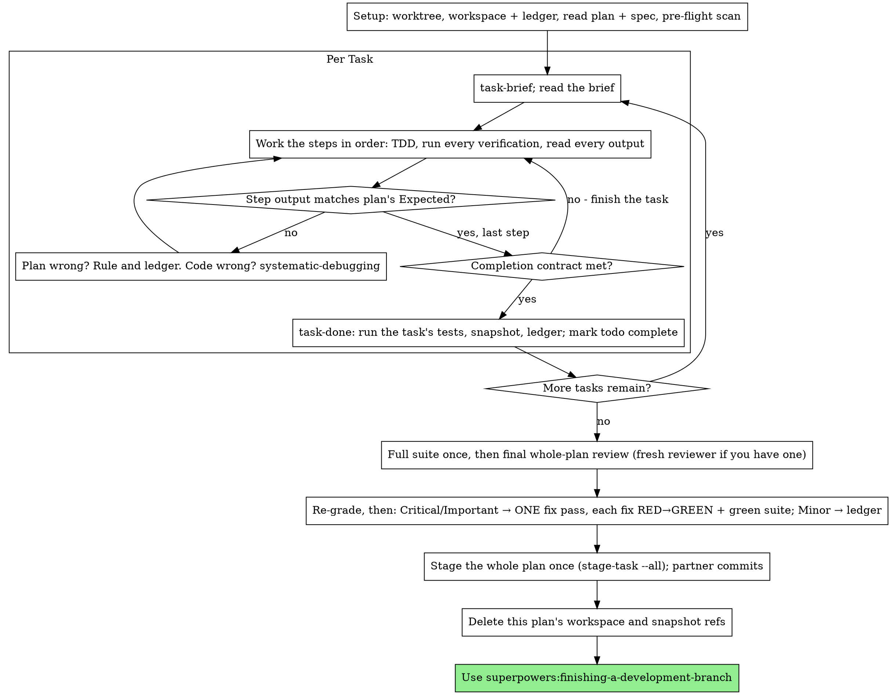

# Executing Plans

Execute the plan yourself, task by task, in this session: no implementer
subagent per task, no reviewer per task, no commit per task. One
fresh-context review of the whole plan at the end, then your human partner
reviews one staged diff and commits once.

**Why Native:** Subagent-driven development pays for a fresh implementer
and a fresh reviewer on every task, each re-reading the codebase from zero.
Native execution pays for one context (yours) plus one reviewer at the end.
What it gives up is a fresh context per task and a second pair of eyes per
task. This skill keeps what those two things bought, by other means: the
brief is the spec, the ledger is your memory, TDD is the per-task gate, and
the final reviewer is the second pair of eyes.

**Core principle:** The plan already did the thinking. Execute it exactly,
prove each step with a test you watched fail and then pass, and leave a
record that survives your own forgetting.

**Narration:** between tool calls, narrate at most one short line — the
ledger and the tool results carry the record.

**Continuous execution:** Do not pause to check in with your human partner
between tasks. They chose Native execution to spend less, not to answer
"should I continue?" after every task. Execute all tasks from the plan
without stopping.

**You never commit.** Nothing is committed and nothing is staged until the
final review is done. Then you stage the whole plan once, and your human
partner reviews `git diff --staged` and commits.

**Rulings, not stalls.** Conflicts, ambiguities, plan defects — decide them.
The spec is the binding authority, the plan is its argument, and your
judgment settles what neither answers. Record every decision in the ledger
as `Ruling: <what you decided> — <why> — <what it costs if wrong>`, and keep
going. Deviating from the plan without a ledgered ruling is a decision made
in secret.

Four things stop you, and only these: an irreversible or destructive
operation; a security-sensitive action; a side effect outside this worktree
that norms say you ask about first (a merge, a push to a shared branch, a
publish); and a plan so broken that every path forward is a guess. For
those, stop and ask.

## When to Use

- You have a plan from superpowers:writing-plans and your human partner
  chose Native execution at the handoff.
- Your harness has no subagent tool (see the per-platform references in
  `../using-superpowers/references/`). Never fabricate a dispatch; run
  the plan here.
- Tasks are mostly independent — the same precondition as
  superpowers:subagent-driven-development.

A fully specified plan makes Native execution transcription plus testing:
it runs well on a mid-tier session model, and the one place the most
capable model earns its cost is the final review, which this skill
dispatches separately. Tell your human partner so when they choose Native.

Prefer superpowers:subagent-driven-development when your human partner
wants to review and commit each task, or when the plan is long enough that
its later tasks would run on a compacted context. Native execution over a
long plan still works — the ledger and the snapshot refs are what make it
recoverable — but the last tasks get the least of you.

## The Process



## Setup

Ensure the work happens in an isolated workspace: use
superpowers:using-git-worktrees to create one or verify the existing one.
Never start implementation on a main/master branch without your human
partner's explicit consent.

Conversation memory does not survive compaction. An executor that loses
its place re-implements tasks it already finished, paid for in your own
context. A Native run commits nothing, so `git log` cannot tell you what is
done: the ledger and the snapshot refs are the only record. Track progress
in the ledger, not only in todos. Harness todos are a live view; the ledger
is the record.

- Each plan owns a workspace: at skill start, run
  `../subagent-driven-development/scripts/sdd-workspace PLAN_FILE` — it
  prints the plan's git-ignored directory under
  `<repo-root>/.superpowers/sdd/`, home to every artifact for THIS plan:
  ledger, briefs, test logs, review packages. Another plan's directory is
  never yours to read or write.
- Check for this plan's ledger at `<workspace>/progress.md`. If its first
  line names your plan file, tasks with a `Task <N>: complete` line are
  DONE — do not redo them; resume at the first task without one. Their
  work sits uncommitted in the working tree even when your context no
  longer remembers making it: after compaction, trust the ledger over your
  own recollection. If `git status` shows a finished task's files lost,
  bring each back with
  `../subagent-driven-development/scripts/restore-task PLAN_FILE N`, in
  task order. A ledger whose first line names a different plan file is
  another plan's progress: leave it and start your own, fresh.
- Create the ledger with its identity as the first line:
  `# SDD ledger — plan: <plan file path>`.
- `git clean -fdx` destroys the workspace and the ledger with it (it's
  git-ignored scratch). The snapshot refs live in `.git` and survive:
  `git for-each-ref refs/superpowers/sdd/<workspace-name>/`, where
  `<workspace-name>` is the last component of the path `sdd-workspace`
  printed, lists every finished task, and `restore-task` brings each back.

Read the plan once, note its context and Global Constraints, and create a
todo per task. If the plan names a Spec, read that too: the spec is the
authority the plan argues from, and conflicts inside the plan resolve
against it. A plan with no reachable spec gets a ledger note saying so —
rulings made without one are provisional.

**REQUIRED SUB-SKILL:** load superpowers:test-driven-development now,
before Task 1. It governs every step of every task below; a plan whose
steps already say "write the failing test first" does not exempt you
from reading it.

Before Task 1, scan the plan for conflicts between tasks. The plan's
Interfaces blocks tell you where to look: for every task that consumes
what an earlier task produces, one ledger row — the two tasks, what one
produces against what the other consumes, and what you found. Tasks that
share nothing get no row; a plan whose tasks share nothing gets the single
line `Pre-flight: no shared interfaces`. Rule on each conflict a row
surfaces with the spec as the binding authority, record the ruling beside
its row, and start Task 1. Each task's own text is checked when you read
its brief, not here.

## The Task Loop

Everything you print, and every tool result, stays resident in your
context for the rest of the session. Redirect long test output to a file
in the workspace and read its tail; read a brief, not the whole plan.

### 1. Take the task

- Run `../subagent-driven-development/scripts/task-brief PLAN_FILE N`. It
  writes the task's full text to the workspace and prints the path. Read
  the brief for every task, including ones you remember from setup: what
  you remember is a summary, the brief has the exact values, signatures,
  and test cases.
- Mark the task's todo in_progress.

Every tool call is a turn that re-reads your whole context. Bookkeeping
rides along with work: `task-done` runs the tests, snapshots the task, and
writes its ledger line in one call.

### 2. Work the steps

The plan's steps are already in RED-GREEN order; follow them in that
order under superpowers:test-driven-development, loaded at setup. A test
step's code is written first and run first. Watching it fail is a step,
not a formality — a test that passes before the implementation exists is
a finding about the test.

Every step that runs a command has an `Expected:` line. Run the command,
read its output, and compare. Three outcomes:

- **Matches.** Next step.
- **The code is wrong.** Use superpowers:systematic-debugging. Find the
  cause; never patch the symptom to make the step's output match.
- **The plan is wrong** — a step contradicts the spec, an interface from an
  earlier task doesn't match what this task consumes, a command that
  cannot work. Rule on the smallest change that satisfies the spec, ledger
  it as `Task <N>: Ruling: <finding> — <what you decided and why>`, and
  continue. The ruling is carried, not remembered: later tasks that touch
  the same interface read it from the ledger.

Touch only the files the task's **Files:** list declares. `task-done`
snapshots exactly those paths and the final stage collects exactly those
paths, so an undeclared write never reaches your partner's commit. If a
ruling needs a file the task does not list, add it to that task's Files
list in the plan first and say so in the ruling's ledger line.

A plan step that says to report the files touched and propose a commit
message is satisfied by `task-done`'s ledger line. Do not stage and do not
commit; you propose one message for the whole plan at the end.

### 3. The completion contract

Before a task's ledger line, all of the following are true, with evidence
in this session — not inferred from the diff looking right:

- Every test the brief names exists and ran in this task, and you read
  the output.
- The final test run for the task passed — `task-done` is that run, and
  it writes the command and result into the ledger line.
- Every `Expected:` line in the brief was compared against real output.
- Every deviation from the brief has a `Ruling:` line in the ledger.

**REQUIRED SUB-SKILL:** superpowers:verification-before-completion governs
the claim. If any item is missing, the task is not complete: finish it.

### 4. Complete the task

Run this skill's `scripts/task-done PLAN_FILE N -- <test command>` with the
test command the brief names for the whole task — the task's own tests,
not the project's suite, which runs once before the final review. It runs
the tests, keeps the full output in the workspace, prints the tail, and —
only if they pass — snapshots the task's declared files to a ref and
appends the completion line to the ledger:

`Task <N>: complete files=<paths> ref=<snapshot ref> tests: <command> → <result>`

A failing run records nothing; the task is not complete. When it records,
mark the todo complete and take the next task.

## Final Review

Run the project's full test suite once — the first full run of this plan.
Redirect it to `<workspace>/final-suite.log` and read its tail. Every
failing test, by name, is a finding for the fix pass below, including one
no task caused.

Build the package from the working tree, because nothing is committed yet
and a commit range would be empty:

```bash
../subagent-driven-development/scripts/review-package PLAN_FILE --plan "$(git merge-base main HEAD)"
```

**With a subagent tool:** dispatch the reviewer on the most capable
available model — the whole-plan review is a judgment task — using
superpowers:requesting-code-review's
[code-reviewer.md](../requesting-code-review/code-reviewer.md), with the
package path, the plan and spec paths, the tail of `final-suite.log`, and
a pointer to the ledger's `Ruling:` lines so it can weigh the calls you
made. Specify the model explicitly; an omitted model inherits the
session's, which may not be the most capable. This is the one fresh
context the whole run buys. Do not skip it, and do not replace it with your
own read of the diff.

**Without a subagent tool:** read code-reviewer.md and perform that review
yourself against the package, as a separate pass after the last task's
ledger line. Write `Final review: self-review (no subagent tool)` to the
ledger, and say so when you hand over: a self-review by the author is
weaker than a fresh reviewer, and your human partner decides whether that
is enough before they commit.

Sort the findings before you act on any of them. The reviewer's severity
labels are advice; the gate is yours. Its "Declined to judge" list is
yours too: every line there is a ruling you make and ledger, exactly like
a plan conflict — `Final: Ruling: <behavior the reviewer set aside> —
<what a reasonable person using this software gets, and why that stands
or why it is now a finding> — <cost if wrong>`. Re-grade first, by effect: the
spec is a vision document, and a finding's grade is what a reasonable
person using this software gets if it ships, not whether the spec names
the input that triggers it — a reviewer who set a finding at Minor
because the spec was silent has graded the spec, not the effect. Then:

- **Critical and Important** enter the fix pass.
- **Minor** goes to the ledger as `Final: minor (deferred): <one-liner>`
  and to your hand-over under "Deferred minors". Minors never enter the
  fix pass, and never become rulings — a ruling is a decision about a
  conflict, not a note that you declined a polish suggestion.

Fix the Critical and Important findings yourself — you are the
implementer here — in ONE pass. Each fix is verified by TDD, not by a
second reviewer: write the test that reproduces the finding, watch it
fail, make it pass, then run the whole suite. Record each in the ledger as
`Final: fixed <finding> — <test name> RED→GREEN, suite <N>/<N>`. A fix
without a test that failed first is not verified; a suite that is not
green after the pass means the pass is not over. A fix touches only
declared files, like any task: if it needs another file, add it to the
Files list of the task that owns that behavior and ledger it. Do not
dispatch a re-review: it would re-read a diff whose covering tests already
answer "addressed" and whose suite run already answers "broke nothing".

A finding you decide not to fix is a ruling — `Final: Ruling: <finding> —
<why the code stands> — <cost if wrong>` — and reaches your human partner
in the rulings list. There is no second fix pass.

## Stage and Hand Over

With the fix pass over and the suite green, stage the whole plan once:

```bash
../subagent-driven-development/scripts/stage-task PLAN_FILE --all
```

It refuses a dirty index and validates every task's declared files before
staging any of them — a partial stage reads to your partner as a finished
plan and gets committed as one. It prints each task's stat, so one staged
diff still reads task by task. Present it:

```text
Native run complete: 5 tasks staged as one review.
Proposed:  Add user CRUD endpoints with validation

Task 1: Schema
  src/models/user.py   |  34 ++++
Task 2: API endpoints
  src/api/users.py     |  81 ++++++++
...

Tests:    38/38 passing
Review:   final whole-plan review; 1 Important fixed, 2 minors deferred

Rulings I made:
- Task 2: install_hook → installHook — brief typo against Task 1's Produces — cost if wrong: one rename

Deferred minors:
- README lacks a usage example
- recovery.js could split verify/repair into two files

Review with `git diff --staged`. Commit when ready, or tell me what to change.
```

"Rulings I made" holds every ledger line containing `Ruling:`, in the order
you made them, each with what it costs if wrong; "Deferred minors" holds
every `minor (deferred)` line. Both lists are exhaustive. This is your
partner's first and only sight of the decisions you made on their behalf,
and a ruling you leave out is one they never got to overrule.

If they ask for changes, unstage (`git restore --staged -- .` — the index
held only this plan), make each change with a test that fails first, run
the suite, re-stage with `--all`, and present again. Their requests are not
capped.

## Finish

Once your partner has committed, delete this plan's workspace and its
snapshot refs — the commit is the record now:

```bash
ws=$(../subagent-driven-development/scripts/sdd-workspace PLAN_FILE)
git for-each-ref --format='%(refname)' "refs/superpowers/sdd/$(basename "$ws")/" \
  | xargs -r -n1 git update-ref -d
rm -rf "$ws"
```

Sibling directories and other plans' refs are not yours; leave them alone.

Use superpowers:finishing-a-development-branch.

## Common Rationalizations

| Excuse | Reality |
|--------|---------|
| "I remember what Task N says" | You remember a summary. The brief has the exact values. Read it. |
| "The plan's code is right, skip watching the test fail" | A test you never saw fail proves nothing. It is one step. Run it. |
| "I'll skip the per-step runs and test once at the end" | Per-step runs are how you learn which step broke it. `task-done` is the task's contract; the suite before the final review is the plan's. |
| "The plan is wrong here, I'll just do the right thing" | Do the right thing and ledger the ruling. Unledgered deviation is a decision made in secret. |
| "I'll run task-done after a few tasks" | Compaction does not wait for a convenient moment. Without its ledger line and snapshot, a finished task is indistinguishable from an unstarted one. |
| "Let me check in before the next task" | They chose Native to spend less. Progress prompts spend their time instead. Only the four stops stop you. |
| "I'll commit this task so it's safe" | You never commit. The snapshot ref is what makes it safe; your partner commits once, at the end. |
| "I'll stage what's done so they can look at progress" | One stage, at the end. A partial stage reads as a finished plan and gets committed as one. |
| "This needs one more file, I'll just edit it" | Add it to the owning task's Files list first. The stage collects declared paths only; an undeclared edit never reaches the commit. |
| "I read my own diff carefully; the final reviewer is redundant" | Same author, same blind spots. The reviewer is the only fresh context this run buys. |
| "Tests should pass, the change was trivial" | "Should" is not evidence. The contract requires the command and its output. |
| "Subagents are slow and expensive, I'll skip the final review too" | Native already removed the per-task reviewers. One review of the whole plan is the floor, not the ceiling. |
| "The reviewer said Minor, so it's Minor" | The label graded the spec's silence. Grade what the person gets. Re-grade, then gate. |
| "The fix is obvious, no need for a failing test first" | The failing test is the only proof the finding was real and is now gone. Without it you have a diff and a hope. |
| "I'll fix the minors too while I'm in there" | Every minor you fix is a test, a fix, and a suite run your partner did not ask for. Ledger them; your partner decides. |

## Example Workflow

```
You: I'm using the executing-plans skill to implement this plan natively.

[Setup: worktree verified]
[Read plan once: docs/superpowers/plans/feature-plan.md; spec read]
[Resolve workspace: sdd-workspace docs/superpowers/plans/feature-plan.md — no ledger inside, fresh start]
[Pre-flight scan: 2 shared-interface rows, clean; written to ledger]
[Create todos for all tasks]

Task 1: Hook installation script

[task-brief plan 1 → brief read]
[Step 1: write failing test — written]
[Step 2: run it — FAIL: install_hook not defined. Matches Expected.]
[Step 3: implement — written]
[Step 4: run it — PASS 1/1. Matches Expected.]
[Contract: tests ran, output read, no deviations]
[task-done plan 1 -- npm test -- hooks → ledger: Task 1: complete files=src/hooks.js,test/hooks.test.js ref=refs/superpowers/sdd/feature-plan/task-1 tests: npm test -- hooks → 1/1 pass]

Task 2: Recovery modes

[task-brief plan 2 → brief read]
[Step 2: run failing test — FAIL, but on an import error: Task 1 exported
 installHook, brief consumes install_hook]
[Ruling: brief's consumer name is a typo against Task 1's Produces block;
 use installHook — Ledger: Task 2: Ruling: install_hook → installHook — matches Task 1 Produces — cost if wrong: one rename]
[Steps 3-4 as planned]
[task-done plan 2 -- npm test -- recovery → ledger: Task 2: complete files=src/recovery.js,test/recovery.test.js ref=refs/superpowers/sdd/feature-plan/task-2 tests: npm test -- recovery → 8/8 pass]

...

[After all tasks: npm test > final-suite.log → 12/12]
[review-package plan --plan MERGE_BASE; dispatch code-reviewer, most capable model]
Reviewer: One Important finding — progress reporting interval hardcoded. Two Minor. Declined to judge: none.
[Re-grade: Important stands; minors → ledger as deferred]
[Fix pass: test_progress_interval_configurable RED → extract PROGRESS_INTERVAL → GREEN; suite 13/13]
[Ledger: Final: fixed hardcoded interval — test_progress_interval_configurable RED→GREEN, suite 13/13]
[stage-task plan --all → 5 tasks staged; hand-over presented with rulings and deferred minors]

Partner: [reviews git diff --staged, commits]

[Delete this plan's workspace and snapshot refs]

Using superpowers:finishing-a-development-branch.
```
